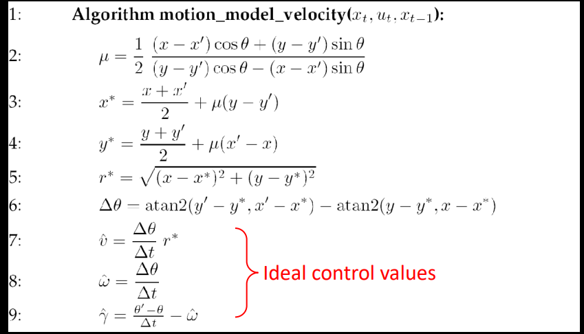
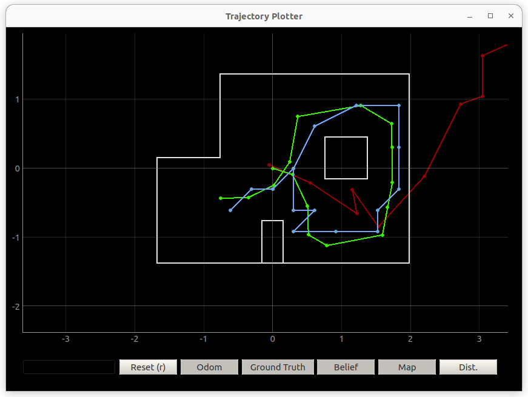

## Objective
In this lab the goal is to use a Bayes filter to predict the robots location

## Prelab

Setting up simulator was difficult. I have been doing all the labs on Linux so there were a few issues getting the simulator setup. One issue was using pip to install ipywidgets was not updating it to the latest version, so it needed to be uninstalled and then reinstalled with sudo. Additionally, I had another issue with the qt6 library. With help from the TA's, we tried a few of the fixes from this [forum](https://forum.qt.io/topic/93247/qt-qpa-plugin-could-not-load-the-qt-platform-plugin-xcb-in-even-though-it-was-found). I do not know which command fixed it. I just hope that anyone in the future who uses Linux for this class can get some help from this.

## Lab

### Compute Control

For compute_control, the steps were fairly simply. I used the velocity model discussed in lecture:



Here is the code I used: I had to take the cur_pose and prev_pose and change it from a tuple to a numpy array to use with later functions.
```python
def compute_control(cur_pose, prev_pose):
    cur_pose = np.asarray(cur_pose)
    prev_pose = np.asarray(prev_pose)
    delta_rot_1 = np.rad2deg(np.arctan2(cur_pose[1]-prev_pose[1],cur_pose[0]-prev_pose[0])) - prev_pose[2]
    delta_trans = np.linalg.norm(cur_pose[:2]-prev_pose[:2])
    delta_rot_2 = cur_pose[2]-prev_pose[2]-delta_rot_1
    return delta_rot_1, delta_trans, delta_rot_2
```

### Odom Motion Model

The next function `odom_motion_model` just predicts the probability that given the previous position, the current position, nad the control input what the probability is that we ended up in the current position. It uses the previous `compute_control` function to calculate the control input that would take us from the previous position to the current position.
```python
def odom_motion_model(cur_pose, prev_pose, u): 
    u_prop = compute_control( cur_pose, prev_pose )
    
    rot1_x  = mapper.normalize_angle( u_prop[0] )
    rot1_mu = mapper.normalize_angle( u[0] )
    
    trans1_x  = u_prop[1]
    trans1_mu = u[1]
    
    rot2_x  = mapper.normalize_angle( u_prop[2] )
    rot2_mu = mapper.normalize_angle( u[2] )
    
    prob_rot1   = loc.gaussian( mapper.normalize_angle( rot1_x - rot1_mu ), 0, loc.odom_rot_sigma )
    prob_trans1 = loc.gaussian( trans1_x - trans1_mu, 0, loc.odom_trans_sigma )
    prob_rot2   = loc.gaussian( mapper.normalize_angle( rot2_x - rot2_mu ), 0, loc.odom_rot_sigma )
    
    prob = prob_rot1 * prob_trans1 * prob_rot2

    return prob
```

### Prediction Step

The next function performs the prediction step for the bayes filter. In this step we are updating the belief based on the odometry data.

```python
def prediction_step(cur_odom, prev_odom):
    u = compute_control( cur_odom, prev_odom )
    temp = np.zeros((12, 9, 18))
    
    for cx_prev in range(12):
        for cy_prev in range(9):
            for ca_prev in range(18):
                
                if ( loc.bel[ cx_prev, cy_prev, ca_prev ] > 0.0001 ):

                    for cx_cur in range(12):
                        for cy_cur in range(9):
                            for ca_cur in range(18):

                                cur_pose = mapper.from_map( cx_cur, cy_cur, ca_cur )
                                prev_pose = mapper.from_map( cx_prev, cy_prev, ca_prev )
                                p = odom_motion_model( cur_pose, prev_pose, u )
                                bel = loc.bel[ cx_prev, cy_prev, ca_prev ]

                                temp[ cx_cur, cy_cur, ca_cur ] += (p * bel)
    
    sum_val = np.sum(temp)
    loc.bel_bar = np.true_divide( temp, sum_val )
```

### Sensor Model
In this step we calculate the probability that we have a certain sensor reading given our robot pose.

```python
def sensor_model(obs):
    prob_array = []
    for i in range(18):
        prob_array.append( loc.gaussian( loc.obs_range_data[i], obs[i], loc.sensor_sigma ) )
    return prob_array
```

### Update Step
Now with the sensor conditional probability and the belief we can update the probabilities.

```python
def update_step():
    for cx_cur in range(12):
        for cy_cur in range(9):
            for ca_cur in range(18):
                bel_bar = loc.bel_bar[ cx_cur, cy_cur, ca_cur ]
                p = sensor_model( mapper.get_views( cx_cur, cy_cur, ca_cur ) )
                p_mul = np.prod(p) 
                loc.bel[ cx_cur, cy_cur, ca_cur ] = p_mul * bel_bar
    # Normalize
    sum_val = np.sum(loc.bel)
    loc.bel = np.true_divide( loc.bel, sum_val )
```

## Results

I next ran the full simulation and compared the ground truth (Green), odometry model (Red), and Bayes filter (Blue):



The bayes filter model is superior to the odometry model. This can be expected because errors quickly accumulate in the odometry model. What is interesting to see is that the bayes filter is able to get better given additional data and becomes very close at tracking the actual ground truth.

Here is a video of the simulation:

<iframe width="560" height="315" src="https://www.youtube.com/embed/ljI-Bj6B5kI" title="YouTube video player" frameborder="0" allow="accelerometer; autoplay; clipboard-write; encrypted-media; gyroscope; picture-in-picture; web-share" allowfullscreen></iframe>
