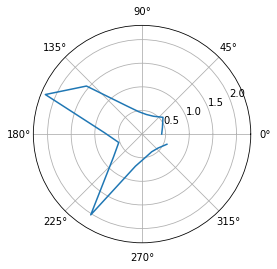

# Objective
The objective of this lab is to perform localization on the robot with the Bayes filter implemented.

# Simulation
First, I ran through the simulation file to see a comparison between the odometry model, the bayes filter model, and the actual position.

Screenshot of the result:


The green represents the ground truth, the blue represents the bayes filter, and the red represents the odometry model. The bayes filter is able to more closely track the correct position of the car throughout its trajectory. The odometry model very quickly goes off track.


# Localization

My first step was to implement `perform_observation_loop` in the `RealRobot` class. 
Here is my implementation:

<script src="https://gist.github.com/rkansara1/37ec51c0559462bf4c8de3d9309b3b18.js"></script>

Additionally I needed to add a notification handler:

```python
s = []
async def string_notification(uuid, bytearray):
    s.append(ble.bytearray_to_string(bytearray))
    LOG.info(ble.bytearray_to_string(bytearray))
        
ble.start_notify(ble.uuid["RX_STRING"],string_notification)
```

`perform_observation_loop` is implemented similarly to [Lab 9](/ECE-4160/labs/lab9/writeup.md). One change I needed to make was have the program pause while data was still being collected. To do this I just check the length of the string list coming in from the notification handler. Once it has collected 18 strings it knows the data collection is over and it can now process the values. The program takes 5 distance measurements at each angle increment to account for any poor sensing, so in the function each grouping of 5 is averaged.


# Localization Results

Here are the results of running the localization at the four marked points in lab. The points in lab are measured in feet but everything is converted into meters for the simulation.


|            | Simulation      | Polar             | Belief                |
|------------|-----------------|-------------------|-----------------------|
| P1 (-3,-2) |  |  | (-0.914,-0.610,10.00) |
| P2 (0,3)   |  |  | (0.000,0.914,10.00)   |
| P3 (5,3)   |  |  | (1.829,0.610,10.00)   |
| P4 (5,-3)  |  |  | (1.829,-1.219,10.00)  |

Video Localizing around Point P2:

<iframe width="560" height="315" src="https://www.youtube.com/embed/VWdVWnRg5Wc" title="YouTube video player" frameborder="0" allow="accelerometer; autoplay; clipboard-write; encrypted-media; gyroscope; picture-in-picture; web-share" allowfullscreen></iframe>


I was able to localize about each point. Something incredibly odd that occurred was the first day I attempted this, I was able to easily localize around points P3, and P4 with sufficient accuracy. The localized point was only off by a small radius. However, I was not able to localize about P1, or P2 at all. The model would pick a point far away. The next day I attempted to localize about P1 and P2 again and I instead got perfect localization results with the belief being the exact point as the ground truth. I do not know how or why the program became so accurate. The one major inaccuracy with each position was the heading it believed it was at. The heading is always supposed to end at 340 degrees because the program only rotates 17 times in 20 degree increments, however the believed heading was always 10 degrees. This difference is probably due to 