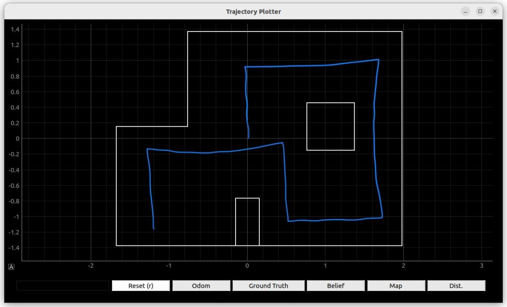

# Objective
The objective of this lab is to navigate the robot on the map through a set of given waypoints. The waypoints are in feet:
```
1. (-4, -3)   
2. (-2, -1)
3. (1, -1)
4. (2, -3)
5. (5, -3)
6. (5, -2)
7. (5, 3)
8. (0, 3)
9. (0, 0)    
```

The map looks like this: (from Lab description)


# Strategy

My strategy was to move using feedback control, localize to determine position, and then move again. Further, to move I would take advantage of the motion model we used in the previous lab, the turn-go-turn procedure. For example to get from the first waypoint at (-4,-3, O) (x coordinate, y coordinate, and angle) to the second waypoint (-2,-1,0), I would turn 45 degrees counter clockwise using orientation control, move 2.83 feet using position control, and then rotate 45 degrees clockwise back to zero degrees again using orientation control. Then, the robot would localize to see if it achieved its goal. If the robot was within a .3 meter radius then it would be deemed a success and the next path would be executed.

# Setup
My first step for the lab was integrating all the code I had written over the past few labs. To successfully complete this path, my robot needed to be able to control it's movement. It needed a way to precisely tell how far forwards and backwards it was moving. It needed a way to also to know its orientation. Finally it needed the ability to localize on the map.

This was initially difficult because to accomplish all three of those previous tasks which I did in Labs 6, 9, and 11 respectively I had modified my robots program so that it could only do that one thing. However, I was able to combine all of these things into three different switch cases. The code is linked right [here](https://gist.github.com/rkansara1/84534a53be9e91c82f8f556b4f8e8398).

Next I had to make modifications to the jupyter notebook. I had to modify the notification handler to parse the data as it received it.
```python
curr_dist= 0
async def string_notification(uuid, bytearray):
    global curr_dist
    s = (ble.bytearray_to_string(bytearray))
    LOG.info(ble.bytearray_to_string(bytearray))
    s = s.split("|")
    for i in s:
        if (i[:2] == "D2"):
            robot.dist.append(float(i[3:]))
        if (i[:2] == "YA"):
            robot.yaw.append(float(i[3:]))
        if (i[:2] == "QD"):
            curr_dist = (float(i[3:]))
        
ble.start_notify(ble.uuid["RX_STRING"],string_notification)
```

After some testing, I came to the conclusion that my sensor for my yaw was too inaccurate. Although I had gone through the process of calibrating it through accounting for sensor drift, the robot would still overtime lose its orientation and become askew. Each time the robot localized it believed it's angle was different than the actual robot angle. All of these small inaccuracies would slowly add up and although the point of localization is to fix this issue, I was not confident it would come together to work properly. Instead I readjusted my strategy to just move through the waypoints using position and orientation control and not using localization to determine where I was. Here was my new trajectory to fully take advantage of the ToF sensors.




# SUCCESSFUL RUN!
<iframe width="560" height="315" src="https://www.youtube.com/embed/q0lyhdeMGvw" title="YouTube video player" frameborder="0" allow="accelerometer; autoplay; clipboard-write; encrypted-media; gyroscope; picture-in-picture; web-share" allowfullscreen></iframe>