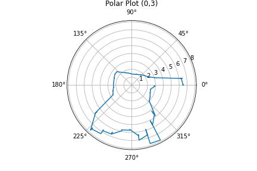

### Goal

In this lab I was tasked with mapping out a static room. This static room will be used in future labs, so obtaining a quality mapping of it will help with future efforts.


### Control

To map out the room, my robot needs to be able to rotate at either a constant rate or to constant positions. I chose to design an closed loop controller for the former. To measure the angle of rotation, in this case yaw, I needed to use the IMU. Luckily in [Lab 4](/ECE-4160/labs/lab4/writeup), I developed a method to use the IMU and get the yaw of the car.

The first initial problem with performing this type of control was sensor drift. Over time, the yaw angle slowly drifts even if the car remains still. This means given enough time the robot will believe it is at 180 degrees even if it hasn't moved. To fix this issue, I sampled the IMU over set time period, observed the drift, and then subtracted that value from the sensor output. This way the sensor drift would be accounted for. Here is the code I used to achieve this:

```c++
case CALIBRATE_IMU:
    {
    float yaw_g_calibrate = 0;
    float t0 = millis();
    float tNow = t0;
    float deltaT = 0;
    for (int inc = 0; inc < 10000; inc++) {
        while (!myICM.dataReady()) {
        delay(1);
        }
        myICM.getAGMT();
        deltaT = (millis() - tNow) / 1000.0;
        tNow = millis();
        yaw_g_calibrate = yaw_g_calibrate + myICM.gyrZ() * deltaT;
        Serial.println(yaw_g_calibrate);
    }
    IMU_Drift_Constant = yaw_g_calibrate / ((millis() - t0) / 1000.0);
    Serial.println(yaw_g_calibrate);
    Serial.println(millis() - t0);
    Serial.println(IMU_Drift_Constant);
    tx_estring_value.clear();
    tx_estring_value.append("IMU_Drift_Consant: ");
    tx_estring_value.append(IMU_Drift_Constant);
    tx_characteristic_string.writeValue(tx_estring_value.c_str());
    }
```

Running this block of code resulted in 11.15 degrees of drift over 40594 ms, giving a drift constant of 0.27. I then incorporated this to where I was calculating yaw.

`yaw_g = yaw_g + myICM.gyrZ() * dt + (IMU_Drift_Constant * dt);`

Implementing the rest of the control loop was simple because it reused the same principals developed in [Lab 6](/ECE-4160/labs/lab6/writeup). Here is what the control loop looks like:

<script src="https://gist.github.com/rkansara1/739f17305bda2feb67c97bfa1b7294ff.js"></script>

The robot rotates at 10 degree increments. After it reaches within 2.5 degrees of each ten degree increment it samples the ToF sensor 5 times into an array. After going through a full 360 degree rotation, the data is sent back to the computer.

Here is a video of the robot successfully rotating:

<iframe width="560" height="315" src="https://www.youtube.com/embed/vUQCTslon9o" title="YouTube video player" frameborder="0" allow="accelerometer; autoplay; clipboard-write; encrypted-media; gyroscope; picture-in-picture; web-share" allowfullscreen></iframe>

### Mapping
Next I mapped out the room with the given coordinates. Here are the measuring locations.


At each point I ran the orientation control loop. Here are the results of mapping:

|              | Polar             | Cartesian             |
|--------------|-------------------|-----------------------|
| Origin (0,0) |  |  |
| P1 (-3,-2)   |  |  |
| P2 (0,3)     |  |  |
| P3 (5,3)     |  |  |
| P4 (5,-3)    |  |  |

To translate from polar coordinates I just used a simple polar to cartesian relation. $$ x = r * cos(\theta) \newline y=r*sin(\theta) $$. Using a more complicated rotation matrix was not necessary because the robot starts at each position with the exact same orientation.

I then combined the outputs to receive this mapping:


Using the map I overlaid lines over it to signify the walls. I slightly corrected curves and diagonal lines because I know the walls are not crooked and are orthogonal with each other.
